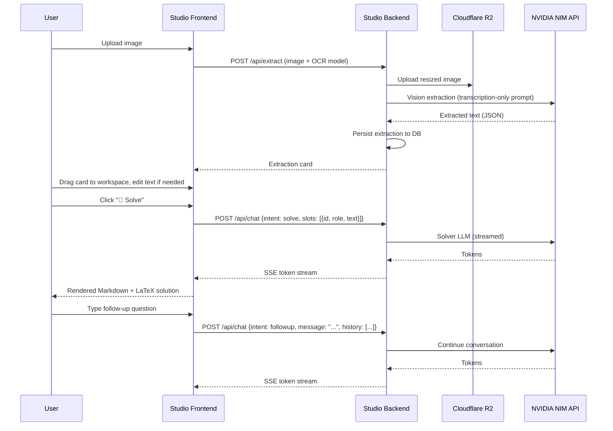
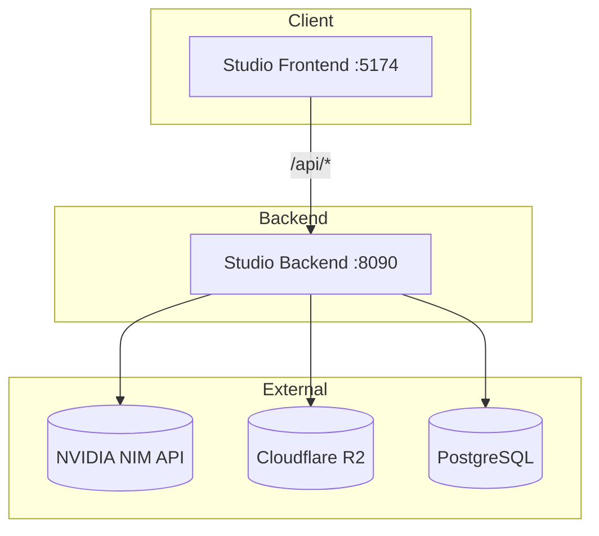

# Saras Studio



 bashfrontend
 go
 npmfrontend
 bash
 bash
1 Hidden Terminal
CHAT
DOCKER PERMISSION DENIED ERROR RESOLUTION
Identified inline markdown formatting issues
The problem is the LLM outputs --- ## Solution and ## Answer inline without line breaks, so the markdown parser treats them as regular text. I'll fix the preprocessor to ensure block-level markdown elements (---, ##, -) get their own lines.

Read Markdown.jsx

Edited
Markdown.jsx+10-0
The preprocessor now forces line breaks before block-level markdown elements that the LLM squashes onto one line:

--- ## Solution → --- + newline + ## Solution
text ## Answer → text + newline + ## Answer
text - **Step 1** → text + newline + - **Step 1**
text **Answer: → text + newline + **Answer:
This runs before the LaTeX fixing pass, so headings, horizontal rules, and bullet lists render as proper block elements.

Restore Checkpoint
add node_modules into .gitignore and .env and any other files that you think should not be pushed

Read .gitignore

Edited
.gitignore+22-0
Now remove any of those files that are already tracked:

git rm -r --cached studio/frontend/node_modules studio/frontend/dist studio/frontend/node_modules/.vite .vscode .env 2>/dev/null; echo "done"
git status --short | head -20
Updated .gitignore with:

An AI-powered **JEE/NEET problem-solving workspace** built on **NVIDIA NIM** LLMs. Upload question images, extract text with vision models, edit the extracted text, then solve, get hints, or evaluate attempts — all streamed in real time with beautifully rendered LaTeX.

---

## Features

- **Multi-model OCR** — Browse NVIDIA NIM vision models grouped by provider. Extract text from question images using any model, as many times as needed.
- **Editable extractions** — Extracted text is rendered as Markdown + LaTeX in workspace slots. Click "✏️ Edit" to fix OCR mistakes or add missing details (diagram angles, values, etc.) before sending to the solver.
- **Side-by-side image + text** — Expand any extraction card to see the original image alongside the rendered extracted text.
- **Drag-and-drop workspace** — Drag extraction cards into the workspace. Label each as **Question** or **Attempt** (togglable). Build multi-card workspaces for evaluation.
- **Intent-based actions**:

  | Intent | What it does | Required slots |
  |--------|-------------|----------------|
  | 🧠 **Solve** | Full step-by-step solution with LaTeX | ≥ 1 Question |
  | 💡 **Hint** | Pedagogical hint without revealing the answer | ≥ 1 Question |
  | 📝 **Evaluate** | Score attempt vs question (0–1) with structured rubric | 1 Question + 1 Attempt |

- **Multi-turn conversation** — Follow up with clarifying questions. Full conversation history is sent with each request.
- **Streamed SSE responses** — Solutions stream token-by-token, rendered as Markdown + KaTeX in real time.
- **Cloudflare R2 storage** — Images uploaded to R2 with public URLs. Graceful fallback to inline data URIs when R2 is not configured.
- **LaTeX preprocessing** — Frontend preprocessor catches bare LaTeX from LLMs and wraps it in proper `$`/`$$` delimiters. Also normalizes inline markdown headings and bullet points.

---

## Workspace Flow

```
┌─────────────── LEFT PANEL ───────────────┐  ┌──────────────── RIGHT PANEL ─────────────────┐
│                                          │  │                                               │
│  🔍 OCR Models    🧠 Solver Models       │  │  📌 Workspace Slots                           │
│  ┌──────────────────────────────────┐    │  │  ┌──────────┐  ┌──────────┐                   │
│  │ Meta  ● Llama 3.2 90B Vision    │    │  │  │ 📋 Question│  │ ✍️ Attempt│                  │
│  │ NVIDIA ○ Llama 3.2 NV Vision    │    │  │  │ rendered  │  │ rendered  │                  │
│  └──────────────────────────────────┘    │  │  │ [✏️ Edit] │  │ [✏️ Edit] │                  │
│                                          │  │  └──────────┘  └──────────┘                   │
│  📷 Drop image or click to upload        │  │                                               │
│  ┌──────────────────────────────────┐    │  │  ┌─────────┐  ┌─────────┐  ┌───────────┐    │
│  │ 🔍 Extract Text                  │    │  │  │ 🧠 Solve │  │ 💡 Hint  │  │ 📝 Evaluate│   │
│  └──────────────────────────────────┘    │  │  └─────────┘  └─────────┘  └───────────┘    │
│                                          │  │                                               │
│  📋 Extractions (3)                      │  │  🤖 Step 1: Identify the forces acting on…    │
│  ┌──────────────────────────────────┐    │  │     Since the ball is on an incline, we…      │
│  │ Llama 3.2 90B  12:34 PM    ⛶    │    │  │                                               │
│  │ A ball of mass 2 kg is thrown…   │    │  │  ┌──────────────────────────────────────────┐ │
│  │ [＋ Add to workspace]  [⇥ Drag]  │    │  │  │ Ask a follow-up question…          Send  │ │
│  └──────────────────────────────────┘    │  │  └──────────────────────────────────────────┘ │
└──────────────────────────────────────────┘  └───────────────────────────────────────────────┘
```

### User Flow

1. **Browse models** — OCR and Solver models grouped by provider with priority-based defaults.
2. **Extract text** — Upload an image. It's resized (max 1568px), stored in R2, and processed by the selected OCR model. The extraction prompt is strictly transcription-only (no solving).
3. **Build workspace** — Drag cards into the workspace. First card auto-labels as Question, subsequent as Attempt. Roles are togglable.
4. **Review & edit** — Extracted text renders as Markdown + LaTeX. Click "✏️ Edit" to fix OCR errors or add diagram details the OCR missed (e.g. "angle ABC = 60°, mass = 2 kg"). The edited text is what the solver sees.
5. **Choose intent** — Click Solve, Hint, or Evaluate.
6. **Follow up** — Multi-turn conversation with full history context.

---

## Sequence Diagram



---

## Architecture



---

## API Reference

Full OpenAPI 3.0 spec: [`swagger.yaml`](swagger.yaml)

| Method | Path | Description |
|--------|------|-------------|
| `GET` | `/health` | Health check |
| `GET` | `/api/models` | List NIM models (OCR & Solver categories) |
| `POST` | `/api/extract` | Extract text from image with OCR model |
| `GET` | `/api/extractions` | List extractions for a session + user |
| `POST` | `/api/chat` | Workspace chat with intents (SSE stream) |

### SSE Event Format

```
data: {"type":"token","text":"<chunk>"}
data: [DONE]
```

### POST /api/chat — Request Body

```json
{
  "session_id": "uuid",
  "user_id": "user-id",
  "model": "deepseek-ai/deepseek-r1",
  "intent": "solve",
  "slots": [
    { "extraction_id": "uuid", "role": "question", "text": "edited text..." }
  ],
  "message": "",
  "history": [
    { "role": "user", "content": "..." },
    { "role": "assistant", "content": "..." }
  ]
}
```

Key: the `text` field in each slot carries the user-edited extraction text. If empty, the backend falls back to the DB-stored version.

---

## Data Model

### `extractions`

| Column | Type | Description |
|--------|------|-------------|
| `id` | `TEXT PK` | UUID |
| `session_id` | `TEXT` | Client session |
| `user_id` | `TEXT` | User identifier |
| `image_url` | `TEXT` | R2 public URL or data URI |
| `extracted_text` | `TEXT` | OCR result |
| `model_id` | `TEXT` | NIM model used |
| `created_at` | `TIMESTAMPTZ` | Timestamp |

---

## Local Setup

### 1) Start Postgres

```bash
docker compose up -d
```

### 2) Configure environment

```bash
cp .env.example .env
```

Set required values — see [Environment Variables](#environment-variables).

### 3) Run Backend

```bash
go run cmd/studio/main.go
```

Backend on `http://localhost:8090`.

### 4) Run Frontend

```bash
cd studio/frontend && npm install && npm run dev
```

Frontend on `http://localhost:5174`, proxies `/api` → `:8090`.

---

## Environment Variables

| Variable | Default | Description |
|----------|---------|-------------|
| `STUDIO_PORT` | `8090` | Server port |
| `DATABASE_URL` | — | Postgres connection URL |
| `LLM_BASE_URL` | `https://integrate.api.nvidia.com/v1` | NVIDIA NIM endpoint |
| `LLM_API_KEY` | — | API key for NIM |
| `LLM_USER_ID` | — | Optional user ID for proxy routing |
| `R2_ACCESS_KEY_ID` | — | Cloudflare R2 access key |
| `R2_SECRET_ACCESS_KEY` | — | Cloudflare R2 secret key |
| `R2_ENDPOINT` | — | R2 S3-compatible endpoint |
| `R2_BUCKET` | — | R2 bucket name |
| `R2_PUBLIC_BASE_URL` | — | Public URL base for uploaded objects |

> R2 variables are optional — when missing, uploaded images use inline data URIs.

---

## Project Structure

```
.
├── cmd/studio/main.go          # Entrypoint (port 8090)
├── swagger.yaml                # OpenAPI 3.0 spec
├── docker-compose.yml          # Postgres
│
├── studio/
│   ├── handler.go              # REST handlers: models, extract, extractions, chat
│   └── extraction.go           # Image resize, vision extraction, LaTeX/JSON utils
│
├── studio/frontend/            # React 19 + Vite SPA (port 5174)
│   └── src/
│       ├── App.jsx             #   Workspace UI (model picker, upload, drag-drop, chat)
│       ├── index.css           #   Dark theme styles
│       └── components/
│           └── Markdown.jsx    #   react-markdown + KaTeX + remark-gfm + LaTeX preprocessor
│
├── config/
│   ├── config.go               # Environment config loader
│   └── models.go               # NIM model registry (~30 models, 6 categories)
│
├── db/
│   ├── pool.go                 # pgxpool connection
│   └── migrate.go              # Schema bootstrap (extractions table)
│
├── llm/
│   └── client.go               # OpenAI-compatible LLM client (streaming + non-streaming)
│
├── middleware/
│   ├── cors.go                 # CORS middleware
│   └── request_id.go           # X-Request-ID middleware
│
└── storage/
    └── r2.go                   # Cloudflare R2 upload client (AWS SDK v2)
```

---

## Tech Stack

| Layer | Technology |
|-------|-----------|
| Backend | Go 1.22+, Gin, pgx v5 |
| Frontend | React 19, Vite 6, react-markdown, remark-math, rehype-katex |
| LLM | NVIDIA NIM (OpenAI-compatible API) |
| Database | PostgreSQL 16 |
| Storage | Cloudflare R2 (S3-compatible) |
| Rendering | KaTeX (LaTeX), remark-gfm (tables, strikethrough) |

---

## Notes

- Migrations are idempotent bootstrap-style SQL (`CREATE TABLE IF NOT EXISTS`, `ALTER TABLE ... ADD COLUMN IF NOT EXISTS`).
- The `user_id` field is a placeholder for OAuth integration — currently `"anonymous"` from the frontend.
- The OCR extraction prompt is strictly transcription-only — it explicitly prohibits solving, explaining, or interpreting the question content.
- Workspace slot text is editable. The edited text is sent directly to the LLM; the DB-stored version is only a fallback.
