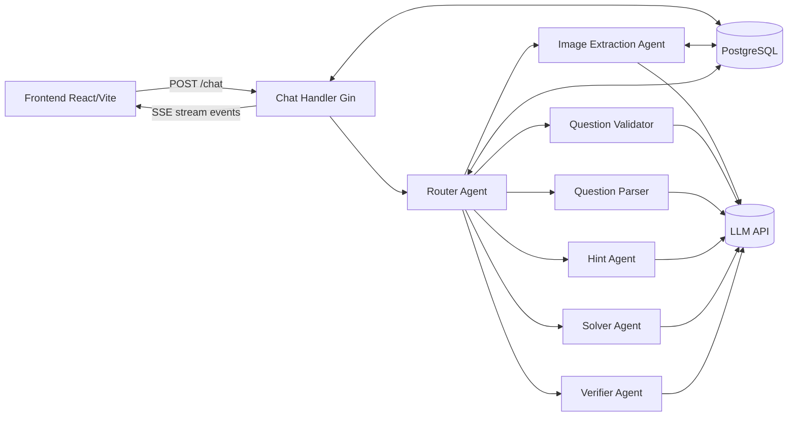
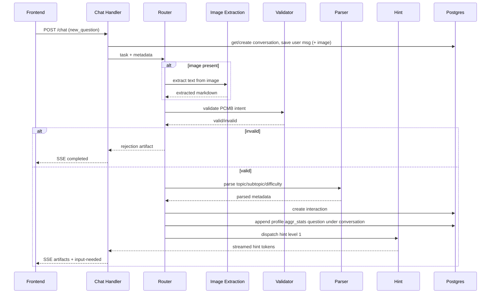
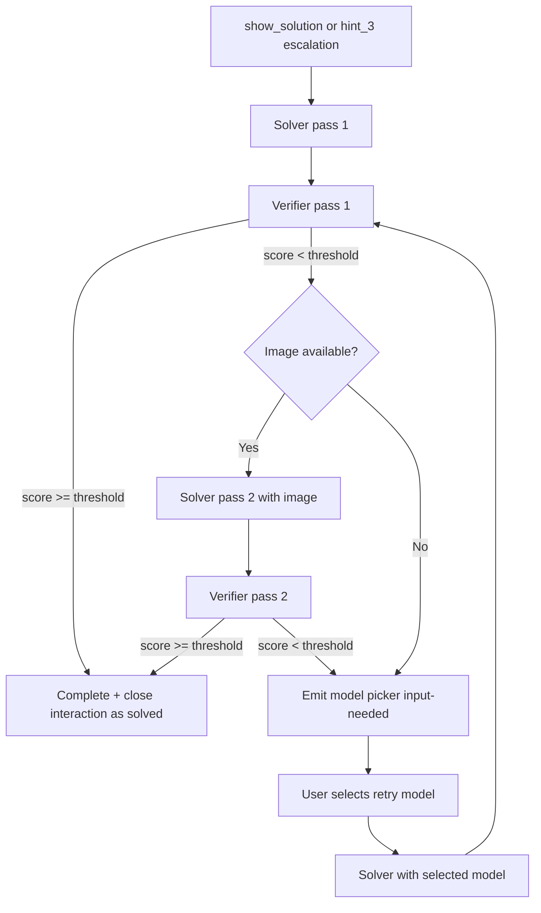

# Saras Tutor

A full-stack, agent-orchestrated tutoring assistant for JEE/NEET-style questions (text + image), with progressive hints, attempt evaluation, solution verification, model retry, and persistent learning memory.

## Implemented Features

- **Deterministic multi-agent orchestration** via a Router agent (`new_question`, `more_help`, `show_solution`, `submit_attempt`, `retry_model`, `close`).
- **Streaming responses over SSE** from backend to frontend.
- **Image question support**:
  - Multipart image upload
  - Server-side image resize (max 1568 px longest side)
  - Image stored in Postgres (`BYTEA`)
  - Vision extraction via `image_extraction` agent
- **Progressive pedagogy**:
  - Hint levels 1 → 2 → 3
  - Escalate to full solution only when requested
- **Solution quality gate**:
  - Verifier scores solver output (0.0–1.0)
  - Auto retry with original image if score below threshold
  - If still low, frontend model-picker is shown
- **Question validation**:
  - Rejects non-PCMB questions (Physics/Chemistry/Mathematics/Biology)
  - Safe fallback: LLM failure → accepts question so student isn't blocked
- **Taxonomy-driven question parsing (4 subjects, ~50 chapters, ~530 topics)**:
  - Covers full JEE (Mains + Advanced) and NEET official syllabi
  - `chapter`, `topics`, `difficulty` (1–4), `variables` extraction
  - All names canonicalized against seed taxonomy at parse time
  - Inference fallback (topic → chapter → subject) when LLM is imprecise
- **Attempt evaluation**:
  - Students submit text or photos of their work between hints
  - Evaluator scores against expected progress for the current hint level
  - Structured rubric: score, strengths, errors, missing steps, next guidance
  - Correct attempts (≥ 80%) auto-close the interaction
- **Interaction memory (short-term)**:
  - Tracks state machine (`new` → `hint_1` → `hint_2` → `hint_3` → `waiting_for_attempt` → `solved`/`closed`)
  - Stores FK references: `subject_id`, `topic_ids` (many-to-many via junction table)
- **Student profile memory (long-term)**:
  - `student_profiles` with `name`, `user_id`, `total_questions`, `aggr_stats`
  - `aggr_stats` is one entry per conversation, each containing question-level records
- **Frontend UX support**:
  - Hint action buttons
  - Attempt submission (text + photo)
  - Model retry picker
  - Markdown + KaTeX + Mermaid rendering

---

## Agent Pipeline

### Topic Extraction (`question_parser`)

Parses raw question text into structured metadata using the full JEE/NEET taxonomy.

- **Taxonomy**: Built at startup from `db.BuildTaxonomy()` — 4 subjects, ~50 chapters, ~530 topics from official syllabi
- **LLM prompt**: Includes the entire taxonomy listing so the model picks exact canonical names
- **Normalization**: All names lowercased with punctuation stripped (`normalize()`) for fuzzy matching
- **Inference chain**: If the LLM returns a topic but not a chapter, `topicToChapterMap` infers it; if chapter is known but subject isn't, `chapterToSubject` fills it in
- **Fallback**: On LLM failure, returns the raw text with empty taxonomy fields — downstream agents still work

**Output** (`ParsedQuestion`):

| Field | Type | Example |
|-------|------|---------|
| `subject` | `string` | `"Physics"` |
| `chapter` | `string` | `"Kinematics"` |
| `topics` | `[]string` | `["Projectile motion", "Uniform circular motion"]` |
| `difficulty` | `int` | `2` (1=easy, 2=medium, 3=hard, 4=very hard) |
| `question` | `string` | Cleaned question text |
| `variables` | `map[string]string` | `{"mass": "2 kg", "velocity": "10 m/s"}` |

### Hint Generation (`hint`)

Delivers progressive, pedagogically-graded hints without revealing the answer.

| Level | Strategy | Detail |
|-------|----------|--------|
| **1** | Gentle nudge | Identify relevant concept/formula, ask a guiding question (3–5 sentences) |
| **2** | Stronger hint | Outline approach, show first 1–2 setup steps, leave main work to student |
| **3** | Detailed walkthrough | Show most steps, student completes only the final calculation |

- Each level has a **distinct system prompt** with explicit rules (e.g., "Do NOT reveal the answer")
- Supports **vision**: at level 3, the original image is attached so the LLM can reference diagrams/circuits
- All output uses Markdown with `$...$` / `$$...$$` for LaTeX math
- After each hint, the system transitions to `waiting_for_attempt` and invites the student to try

### Attempt Evaluation (`attempt_evaluator`)

Scores student work submitted between hints against rubric criteria per hint level.

- Accepts **text or photos** of handwritten work (vision extraction for images)
- Evaluates against **expected intermediate goals** per hint level:
  - After hint 1: student identifies concept/formula + sets up approach
  - After hint 2: first 1–2 steps completed correctly
  - After hint 3: most of solution done, only final calculation remains

**Scoring**:

| Score | Meaning |
|-------|---------|
| 1.0 | Fully correct |
| 0.7–0.9 | Mostly correct, minor errors |
| 0.4–0.6 | Partially correct, significant error |
| 0.1–0.3 | Some understanding but largely wrong |
| 0.0 | No progress or completely wrong |

**Output** (`EvaluatorResult`):

| Field | Type | Description |
|-------|------|-------------|
| `correct` | `bool` | Overall correctness |
| `score` | `float64` | 0.0–1.0 |
| `strengths` | `[]string` | What the student did well |
| `errors` | `[]string` | Specific mistakes found |
| `missing_steps` | `[]string` | Steps the student skipped |
| `next_guidance` | `string` | Tailored 1-sentence advice |
| `hint_consumed` | `int` | Which hint level was active |

- If `correct && score ≥ 0.8`: interaction auto-closes, student gets congratulations
- Otherwise: stays in `waiting_for_attempt`, student can retry, ask for more help, or request the solution

### Solution Generation (`solver` + `verifier`)

Full step-by-step solution with quality verification and automatic retry.

**Solver**:
- Streams a complete worked solution with strict formatting (Markdown + LaTeX + Mermaid)
- Supports vision mode (image attached alongside question for diagrams/circuits)
- Bold key results: `**Answer: $...$**`

**Verifier** (post-solver quality gate):

| Score | Meaning |
|-------|---------|
| 0.9–1.0 | Correct final answer, sound reasoning |
| 0.7–0.8 | Correct approach but minor intermediate errors |
| 0.5–0.6 | Right approach but wrong answer, or missing key steps |
| 0.0–0.4 | Fundamentally wrong approach |

**Quality threshold**: `MinVerifierScore = 0.6`

**Retry flow**:
1. Solver generates solution → Verifier scores it
2. If score < threshold and image is available → retry solver with original image attached
3. If still low → emit model picker so student can choose an alternative LLM
4. Student selects model → solver reruns with that model → verify again

---

## High-Level Architecture



---

## Request & Agent Flow

### New Question (text/image)



### Solver + Verifier + Model Retry



---

## Backend Modules

- `main.go`: bootstraps config, DB pool, migration, seed, Gin routes.
- `handler/chat.go`: parses JSON or multipart input, persists user/assistant messages and images, constructs A2A task and streams SSE.
- `handler/image_resize.go`: image downscale pipeline before persistence.
- `agents/router.go`: deterministic orchestrator — dispatches based on action + interaction state.
- `agents/image_extraction.go`: vision extraction with structured JSON output.
- `agents/question_validator.go`: PCMB intent filtering.
- `agents/question_parser.go`: taxonomy-driven structured metadata extraction + normalization.
- `agents/hint.go`: progressive hint levels (1–3) with distinct prompts per level.
- `agents/attempt_evaluator.go`: scores student work against rubric criteria per hint level.
- `agents/solver.go`: full step-by-step solution generation with vision support.
- `agents/verifier.go`: quality scoring and issue detection for solver output.
- `db/migrate.go`: schema creation (fresh DB, no migration scripts).
- `db/seed.go`: exhaustive JEE/NEET taxonomy seeder (4 subjects, ~50 chapters, ~530 topics).
- `db/store.go`: all persistence logic.
- `llm/client.go`: OpenAI-compatible chat + stream wrapper.

---

## Current Data Model

### `interactions` (short-term memory)

Stores question lifecycle and parsed metadata.

| Column | Type | Description |
|--------|------|-------------|
| `id` | `TEXT PK` | UUID |
| `conversation_id` | `TEXT FK` | References `conversations` |
| `question_text` | `TEXT` | Original question |
| `image_id` | `TEXT` | FK to `images` table (for vision retry) |
| `subject_id` | `BIGINT FK` | References `subjects` |
| `difficulty` | `INT` | 1–4 |
| `problem_text` | `TEXT` | Cleaned parsed question text |
| `state` | `TEXT` | `new\|hint_1\|hint_2\|hint_3\|waiting_for_attempt\|solved\|closed` |
| `hint_level` | `INT` | 0–3 |
| `exit_reason` | `TEXT` | How interaction was resolved |

Topics are linked via the `interaction_topics` junction table (many-to-many).

### `student_profiles` (long-term memory)

| Column | Type | Description |
|--------|------|-------------|
| `user_id` | `TEXT PK` | Unique student identifier |
| `name` | `TEXT` | Display name |
| `total_questions` | `INT` | Lifetime count |
| `aggr_stats` | `JSONB` | Per-conversation question stats |

`aggr_stats` shape:

```json
[
  {
    "conversation_id": "conv-123",
    "questions": [
      {
        "topic_subtopics": ["Kinematics:Projectile motion", "Kinematics:Uniform circular motion"],
        "difficulty_level": 2,
        "hint_level": 1,
        "self_solved": true
      }
    ]
  }
]
```

### `student_attempts` (attempt tracking)

| Column | Type | Description |
|--------|------|-------------|
| `attempt_id` | `BIGSERIAL PK` | Auto-increment |
| `interaction_id` | `TEXT FK` | References `interactions` |
| `user_id` | `TEXT` | Student |
| `hint_index` | `INT` | 1–3 (which hint was active) |
| `student_message` | `TEXT` | Student's submitted work |
| `evaluator_json` | `JSONB` | Structured rubric output |

---

## API

### `GET /health`

Returns:

```json
{"status":"ok"}
```

### `POST /chat`

Supports:
- `application/json`
- `multipart/form-data` (with `image` file)

#### JSON request example

```json
{
  "user_id": "test-user",
  "session_id": "session-1",
  "action": "new_question",
  "message": {
    "content_type": "text",
    "text": "A particle is thrown..."
  }
}
```

#### Actions

- `new_question` — validate → parse → create interaction → hint 1
- `more_help` — escalate to next hint level (or solver if at level 3)
- `show_solution` — full solution via solver + verifier
- `submit_attempt` — evaluate student work, auto-close if ≥ 80%
- `retry_model` (requires `model`) — re-solve with alternative LLM
- `close` — mark interaction as closed, record exit reason

#### Streaming response (SSE event types)

- `status`
- `artifact`
- `transition`
- `metadata`
- `error`
- `new_turn` (used when retrying solver pass)

---

## Local Setup

## 1) Start Postgres

```bash
docker compose up -d
```

## 2) Configure environment

```bash
cp .env.example .env
```

Set required values in `.env`:
- `LLM_API_KEY`
- `LLM_BASE_URL` (or keep default)
- `LLM_USER_ID` (if your proxy requires it)

## 3) Run backend

```bash
go run main.go
```

Backend listens on `http://localhost:8080`.

## 4) Run frontend

```bash
cd frontend
npm install
npm run dev
```

Frontend runs on `http://localhost:5173` and proxies `/chat` + `/health` to backend.

---

## Environment Variables

- `PORT` (default `8080`)
- `DATABASE_URL`
- `LLM_BASE_URL`
- `LLM_API_KEY`
- `LLM_USER_ID`
- `OPENAI_MODEL_DEFAULT`
- `VISION_MODEL`
- `RETRY_MODELS` (comma-separated, e.g. `gpt-5,gpt-4,gemini`)

---

## Notes / Current Scope

- Validation supports PCMB subjects, while structured topic taxonomy is currently most detailed for Physics.
- Migrations are currently bootstrap-style SQL in code (not an external migration framework).
- LLM client currently uses an insecure TLS transport (`InsecureSkipVerify`) intended for controlled/proxy environments.

---

## Quick Project Structure

```text
.
├── a2a/
├── agents/
├── config/
├── db/
├── handler/
├── llm/
├── middleware/
├── models/
├── frontend/
├── main.go
└── docker-compose.yml
```
