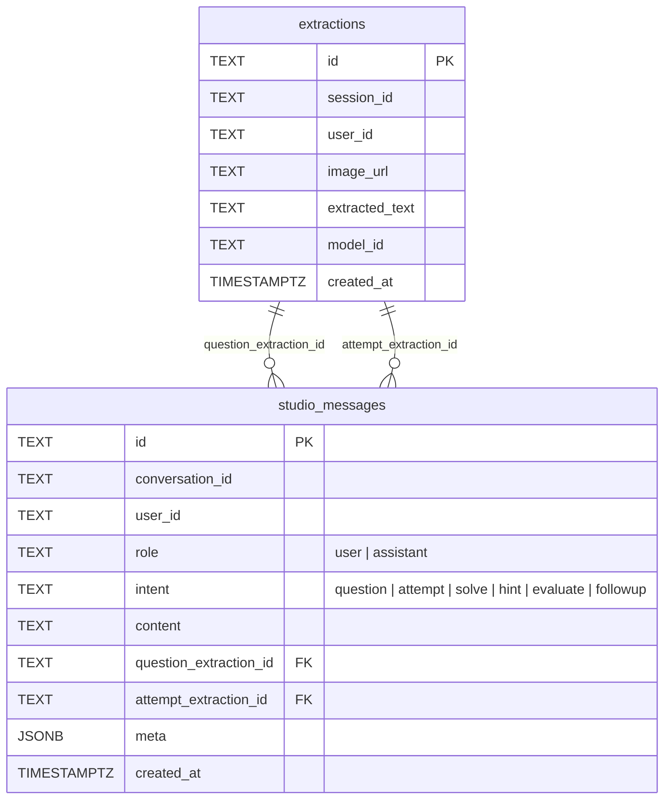

# Entity Relationships

```mermaid
erDiagram
    extractions ||--o{ studio_messages : "question_extraction_id"
    extractions ||--o{ studio_messages : "attempt_extraction_id"

    extractions {
        TEXT id PK
        TEXT session_id
        TEXT user_id
        TEXT image_url
        TEXT extracted_text
        TEXT model_id
        TIMESTAMPTZ created_at
    }

    studio_messages {
        TEXT id PK
        TEXT conversation_id
        TEXT user_id
        TEXT role "user | assistant"
        TEXT intent "question | attempt | solve | hint | evaluate | followup"
        TEXT content
        TEXT question_extraction_id FK
        TEXT attempt_extraction_id FK
        JSONB meta
        TIMESTAMPTZ created_at
    }
```
