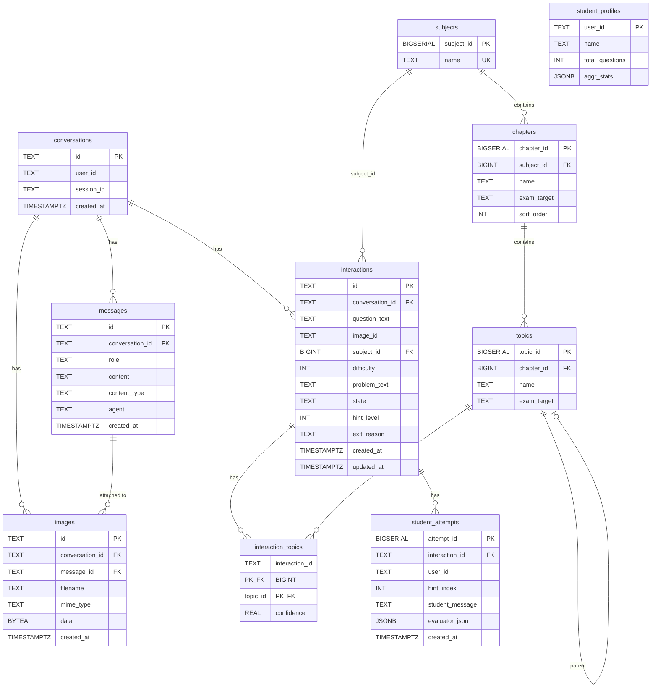

# Entity Relationships

```mermaid
erDiagram
    conversations {
        TEXT id PK
        TEXT user_id
        TEXT session_id
        TIMESTAMPTZ created_at
    }

    messages {
        TEXT id PK
        TEXT conversation_id FK
        TEXT role
        TEXT content
        TEXT content_type
        TEXT agent
        TIMESTAMPTZ created_at
    }

    images {
        TEXT id PK
        TEXT conversation_id FK
        TEXT message_id FK
        TEXT filename
        TEXT mime_type
        BYTEA data
        TIMESTAMPTZ created_at
    }

    subjects {
        BIGSERIAL subject_id PK
        TEXT name UK
    }

    chapters {
        BIGSERIAL chapter_id PK
        BIGINT subject_id FK
        TEXT name
        TEXT exam_target
        INT sort_order
    }

    topics {
        BIGSERIAL topic_id PK
        BIGINT chapter_id FK
        TEXT name
        TEXT exam_target
    }

    interactions {
        TEXT id PK
        TEXT conversation_id FK
        TEXT question_text
        TEXT image_id
        BIGINT subject_id FK
        INT difficulty
        TEXT problem_text
        TEXT state
        INT hint_level
        TEXT exit_reason
        TIMESTAMPTZ created_at
        TIMESTAMPTZ updated_at
    }

    interaction_topics {
        TEXT interaction_id PK_FK
        BIGINT topic_id PK_FK
        REAL confidence
    }

    student_profiles {
        TEXT user_id PK
        TEXT name
        INT total_questions
        JSONB aggr_stats
    }

    student_attempts {
        BIGSERIAL attempt_id PK
        TEXT interaction_id FK
        TEXT user_id
        INT hint_index
        TEXT student_message
        JSONB evaluator_json
        TIMESTAMPTZ created_at
    }

    conversations ||--o{ messages : "has"
    conversations ||--o{ images : "has"
    conversations ||--o{ interactions : "has"
    messages ||--o{ images : "attached to"

    subjects ||--o{ chapters : "contains"
    chapters ||--o{ topics : "contains"
    topics ||--o| topics : "parent"

    subjects ||--o{ interactions : "subject_id"

    interactions ||--o{ interaction_topics : "has"
    topics ||--o{ interaction_topics : "referenced by"

    interactions ||--o{ student_attempts : "has"
```
